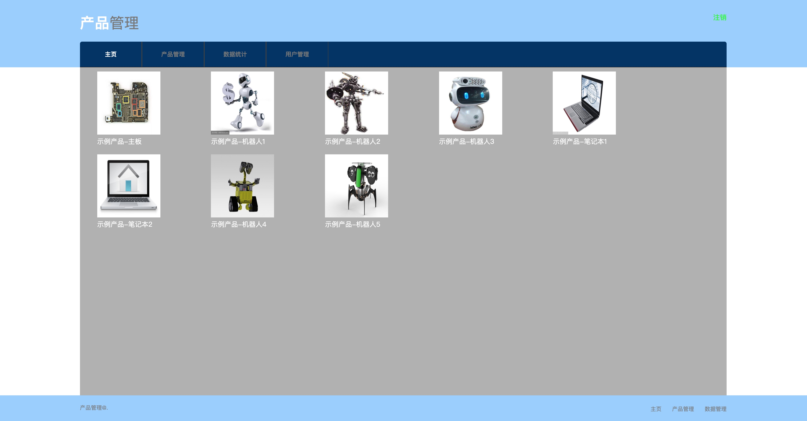
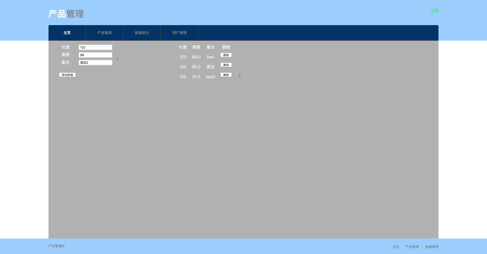
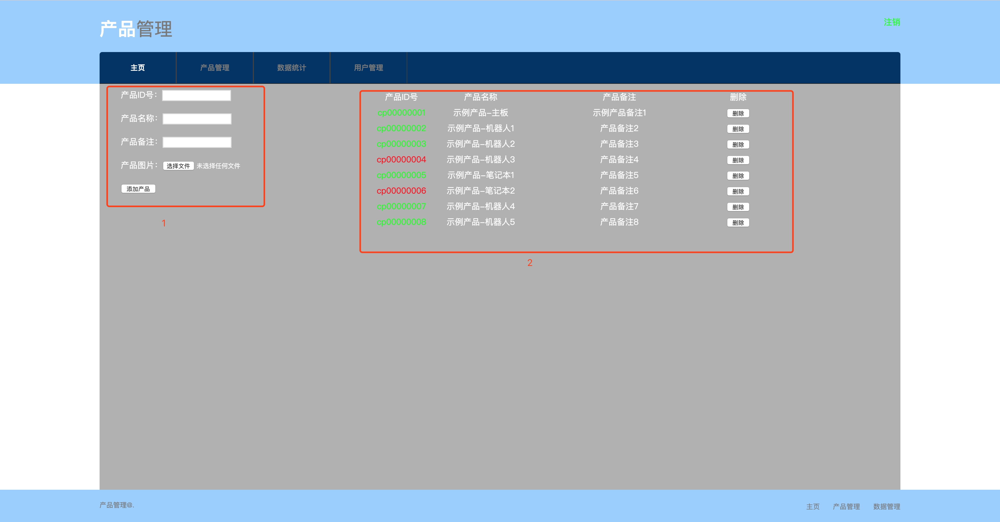
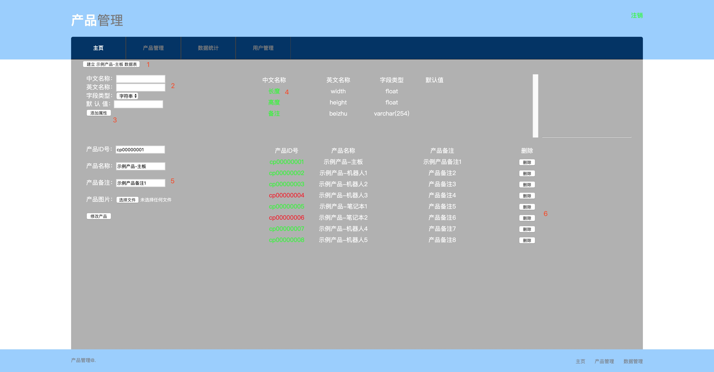
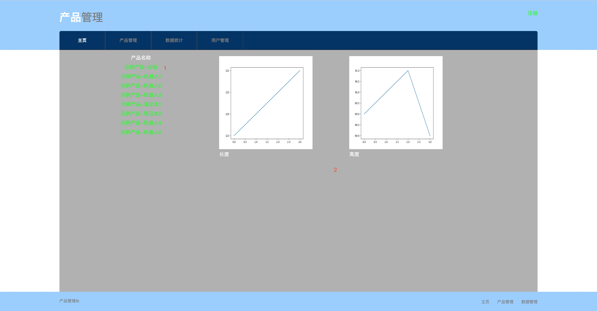

前言
==

系统采用B/S结构模式

支持多工位录入生产测试数据

能直观发现产品生产问题

本设备交付使用, 提供ROBOT\_TEST测试接口

可以接驳RT自动化录入数据,适用于高速自动化生产线

配置
==

### python环境包:

```python
matplotlib==3.0.3
numpy==1.16.3
PyMySQL==0.9.3
tornado==6.0.2
```

### 数据库配置:

备注:

db.sql文件在压缩文件中

```python
mysql -uroot -p密码<db.sql
```

代码第27行:
备注:如果数据库默认使用root账户,则直将本机的数据库root账户密码替换掉 代码中:'数据库密码’引号里的汉字

```python
def db_conn():
    conn = pymysql.Connection(host='localhost', database='product', user='root', password='数据库密码', charset='utf8')
    return conn
```

首页登录
====


输入网址:

127.0.0.1:8000

测试(管理员)账号:

用户:admin

密码:admin123

测试(普通用户):

用户:user01

密码:123456


产品管理主页
======

显示所有生产的产品(用户自己添加)




数据添加
====

1)添加数据:

只能添加字符串或数字类型

备注:数字类型的字段不能添加字符串值,字符串类型字段可以添加数字类型值但该数据不能用于数据统计

2)删除已添加的数据



产品管理
====

1)添加生产的产品

产品ID/名称/备注/图片,不要使用特殊符号或数字为开头

2)管理所有产品



管理所有产品
======

1)建立数据表:新添加的产品首次添加测试字段需要进行:建立数据表操作,否则无法在首页中进行数据值得添加

2)命名规则:不要使用特殊符号或数字以及纯数字作为字段,字符串类型的字段可以添加数字但无法在数据统计中进行统计

3)添加属性字段:添加属性字段后会自动刷新页面,并且在首页-\>产品 进行显示

4)删除字段:点击已添加的属性字段,会删除当前字段(已有数据的字段无法删除)

5)产品管理:可以进行该产品的ID/名称/备注/图片的修改

6)删除产品:点击删除,可以对当前产品进行删除(已有数据的产品无法删除)



数据统计
====

1)所有产品列表

2)对数字类型的字段进行数据统计显示



用户管理
====

1)密码修改:对当前用户的密码修改

2)添加用户:添加新的用户名密码

3)设置权限:对新创建的用户添加权限

4)管理已有账户

