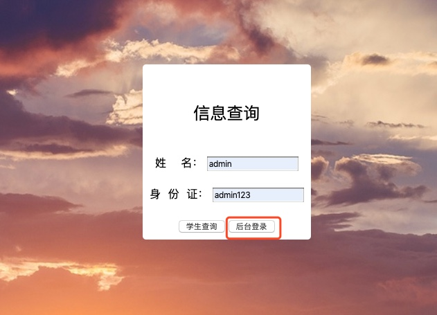
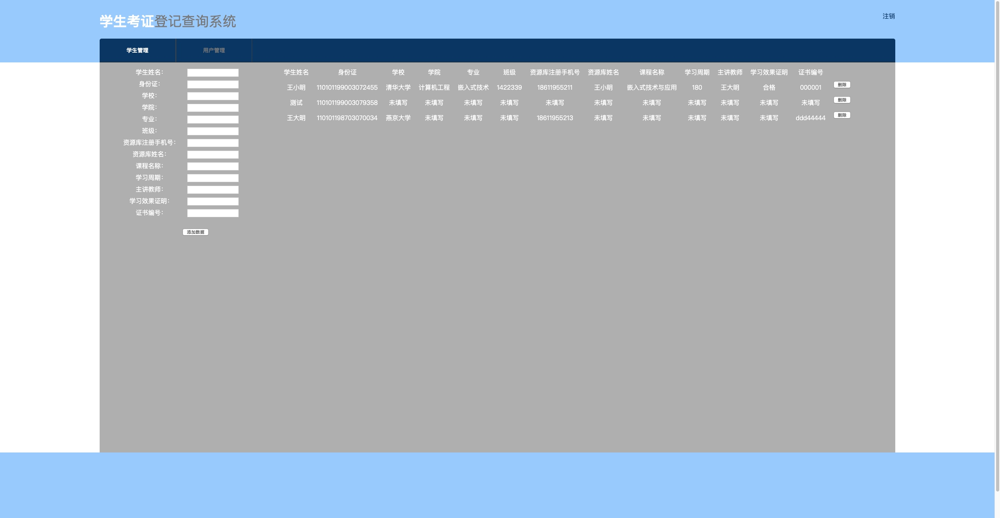
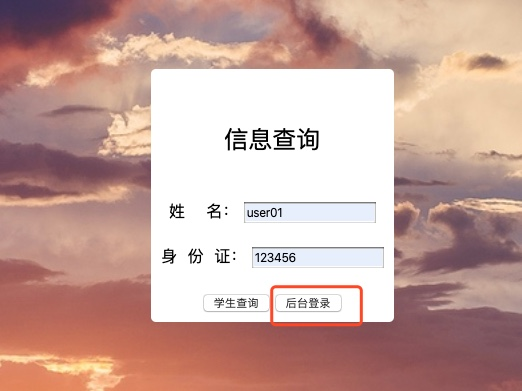
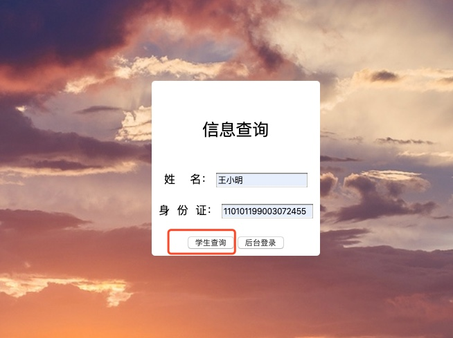
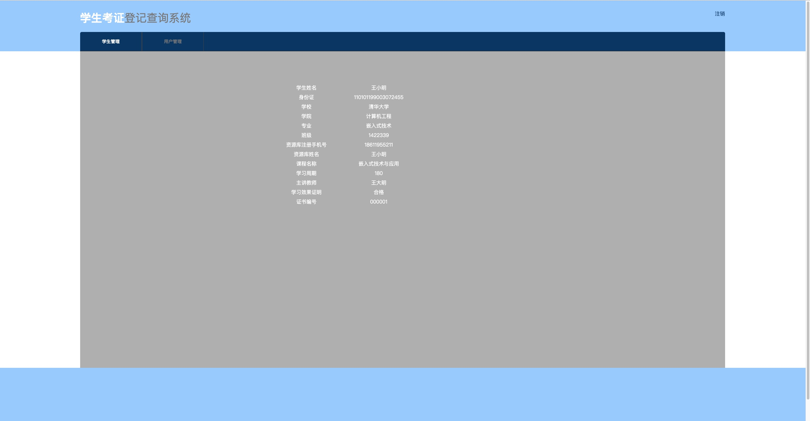
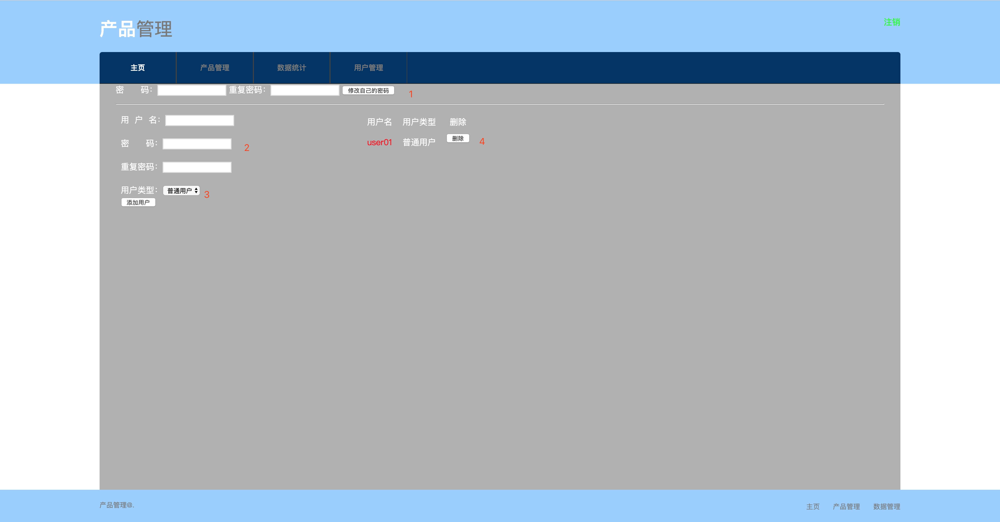

配置
==

### python环境包:

```python
matplotlib==3.0.3
numpy==1.16.3
PyMySQL==0.9.3
tornado==6.0.2
```

```python
python -u main.py > cpzl.log 2>&1 &
```

### 数据库配置:

备注:

db.sql文件在压缩文件中

```python
mysql -uroot -p密码<db.sql
```

代码第27行:
备注:如果数据库默认使用root账户,则直将本机的数据库root账户密码替换掉 代码中:'数据库密码’引号里的汉字

```python
def db_conn():
    conn = pymysql.Connection(host='localhost', database='examination', user='root', password='707116148',charset='utf8')
    return conn
```

首页登录
====

输入网址:

127.0.0.1:8000

测试(管理员)账号:

用户:admin

密码:admin123

测试(普通用户):

用户:user01

密码:123456




添加数据
====

1. 身份证信息为必填项且不得超过18个字符
2. 学生姓名不得超过10个字符
3. 资源库注册手机号不得超过11个字符
4. 其余未填写信息显示”未填写"



后台查询
====

* 普通用户登录后台无法录入删除数据,可以查看所有已录入学生信息




学生查询
====

普通学生查询,输入姓名和身份证后可以查看自己的相关信息



用户管理
====

1)密码修改:对当前用户的密码修改

2)添加用户:添加新的用户名密码

3)设置权限:对新创建的用户添加权限

4)管理已有账户




