谢邀，英语到底怎么学？我总结自身之前英语，西班牙语，以及日语三门语言的学习经验，提炼一套语言学习方法，**特别花了两周写出这篇万字精华攻略，干货满满，建议先赞再看，**从英语学习的方法论到不同阶段的注意要点及教材，听说读写。**英语学习的“道和术”。**

在本文第一部分，我从愿景和方法论两方面重点谈谈语言学习的“**道**”。第二部分，在“道”的基础上，我会专注英语学习的“**术**”， 从学习周期和学习体系出发，结合在不同学习阶段使用的具体的教材推荐以及使用方法。相信不管是零基础或者是中高级的英语学习者都能从这份攻略中找到自己的需要的。

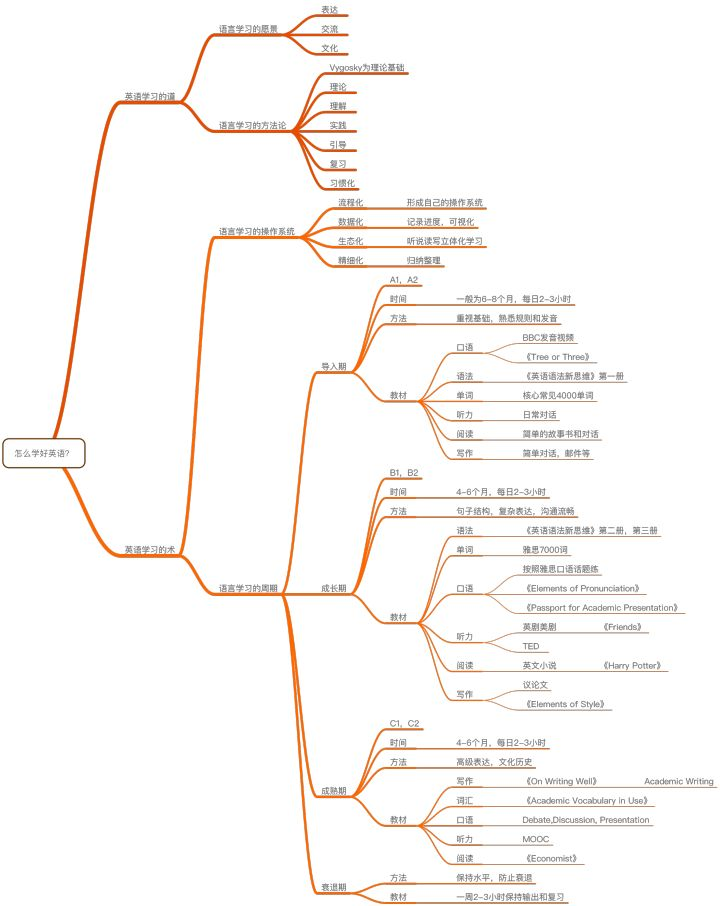

** （全文知识脑图）**

**英语学习的“道”：**

**愿景：为表达，交流，文化而学习语言**

我坚信语言学习并不那么需要天赋，更重要的是日积月累，以正确的方法来进行高效的学习。坚持是最难也是最简单的事情。

让我们一起看看Cambridge
Dictionary 对语言Language的定义：

“a system of communication consisting of
sounds, words, and grammar, or the system of communication used by people in a
particular country or type of work”

语言的本质是一种**被人使用的沟通系统**, 包含声音，词汇以及语法。每一种语言都有独特的使用群体和文化背景。

在应试教育的思维下，往往我们把语言学习当成一项任务，只强调语法和词汇的输入，而没有交流形式的输出。这种思维忽略了语言的本质，让语言学习变得痛苦。**语言学习应该回归其本质，交流、表达和文化这三个维度。**我个人从语言学习厌恶者到语言兴趣爱好者的转变也是由于这一思维的转化。

在学习英语的过程中，刚开始从零开始的跌跌撞撞，到慢慢可以阅读比较基础的英文读物，听懂一部分的外文电台节目。视野也随之变得宽广，世界向你打开了另外一个大门，门后面是语言学习进阶之路。通过坚持学习英语，你领略到一个日益丰富、不同于往日的文化，你手头的积累的信息量也是最新的、高质的。日常生活中帮助老外指路，参加英语角活动认识新的小伙伴，这些点点滴滴都带来惊喜、欣慰以及激励。看到具体英语能力的提升和应用，你感知到“英语是有用的”，你有了自信，也有了继续学下去的动力。

**方法论：理论，理解，实践，引导，复习，习惯化。**

这六个步骤形成我的学习闭环——从最初接触一个语言知识，到把它实践纠正内在化。

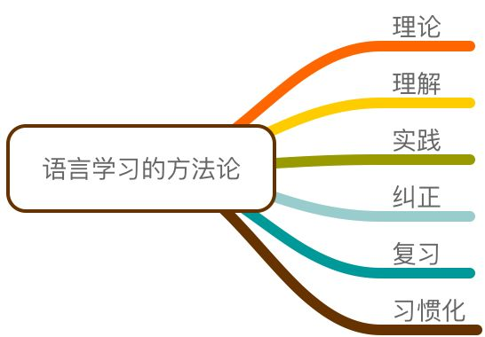

听起来似乎有点抽象，很多小伙伴可能觉得语言学习不就是听说读写，输入输出。作为一枚社会学背景的语言爱好者，我倾向于将其抽象归纳为一套方法论。这一套方法也在之前我写的《如何三年学习英日西三门语言》中提到过，这里再拓展一下。

**其实学习方法都是通用的，这套方法论其实适用于学习任何一项技能。先寻找最本质的真理，强调底层理解，再以高强度强质量的实践去快速熟悉，实践后再寻找已经高度掌握这项技能的导师(mediator) 来帮你纠正，进入下一个“最近发展区”，之后不断地去复习消化，最后把这项技能习惯化，内在化。**

***第一个阶段是“理论”***

**“理论”是指一定要追求事物背后最根本的内涵**。很多时候我们在学习一些事情的时候，看到的都是一些具像化的东西，但是并没有思考它背后的东西到底是什么。

应试教育的语言学习中，点到即止，只追求对错却不知道为什么。这是一个思维上的，一个系统性的大问题。

比如说学习虚拟式，虚拟式的用法是什么，它的源头是什么，为什么在生活中要用虚拟式？它可能表达了不确定的语气、可能表达祈使......它有很多种不同的用法，但你要思考它背后的原理。

就像我举的这个案例，你要去思考这种时态到底希望表达什么，而不是简简单单地记住它，在表达，交流，了解文化中中如何使用。

包括在大学中做的非常多的英文演讲，你可能就会按照老师教的这几句话去讲。但是你要思考做 presentation 到底是为了什么，它背后的东西是什么？如果是为了传递一个
idea （比如TED），那么要在很简短的时间内去讲一件事情，去追求这件事背后的本质，并思考如何以有趣、新颖和互动的方式去交流，这就是我所说的理论。 

**信息时代我们最不缺的就是学习资料了。信息太多了，信息的筛选成本也大大提高。**

很多时候，我们看到英语资料干货就去收集（放到数据库里或者收藏夹里），感觉自己有很多本领。如果单单有了理论但是没有后面的理解包括实践、引导、复习和最后的习惯化。那你并没有去消化，你只是在“知”这个范围内。可能甚至完全没有达到“知”，就不用说后面的“行”了。**很多时候我们没有意识到知与行的鸿沟。**

所以，我们的大多数人可能也只是停留在第一个步骤了，停留在不断地收集干货了。

在这里也送给大家一句话——**“在这个信息时代，不要把自己的收藏当作知识、不要把看到的东西当成自己的、不要把阅读当成掌握”。**

这句话也是我非常深刻的个人体验。

可能太多人都有这样一个癖好——“非常喜欢收集各种干货、非常喜欢下载各种东西、非常喜欢在朋友圈传各种需要分享资料”。首先，我必须承认这是一件好事。但是收集这些资料以后，你需要去从里面找出好的资料，然后理解它。

***第二个阶段是“理解”***

在我看来，理解分为几个不同的层次：

第一层次的理解可能你只是读过一遍文字之后的理解。第二层次的理解可能是读了三遍或者思考了一下，你能用这个东西去完成任务。

第三层次的理解是你可以去教授别人，包括灵活地运用这种东西。当你理解以后你才能够把这个理论讲给别人。

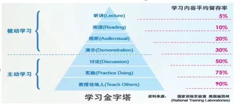

**我们应该追求的也是第三层次的理解——“理解了之后达到完全理解并且能够输出”。**

就像英语中的一个语法，你可能在掌握过去时以后有能力做题目了，你就达到了第一个层次的理解。如果你能够不拘泥于做题，能够在一个合理语境中正确使用过去时，在作文中很好地表达，你就达到了第二个层次的理解。如果你能够讲出来为什么使用过去时，过去完成式和过去时的区别是什么，并且能够教授给其他人，你就已经达到了第三阶段的理解。

***第三个阶段是“实践”***

先举个例子，有天我和朋友们一起去开卡丁车。卡丁车大家可能都有经历，戴个头盔在赛道上开赛车。之前有听过很多道理，怎么在弯道快速地翻越、快速地加速和冲刺。但是我发现，只有我第一次尝试上车，开了第一圈，开了第一个十圈之后，我有稍微一点点的理解，明白了如何开卡丁车，如何配合风速和车速。当时我是最后一名。当第二个十圈开完以后，我发现我有感觉了。感觉可能不是特别容易获得，它一定要通过一定量的实践结合你的理论，并在实践中不断吸收你的理论。

一个英语演讲对语音的把控、语言的掌握都是在不断的实践中不断地去深化理解，变成了“潜意识”和“语感”。这些都是和实践紧密联合在一起的。就像开卡丁车，你可能学了大量的语法，但是你并不知道怎么样实践。只有你真正用到它的时候，你才会知道这样开车是最爽的，这样开车过弯道是最快的......

***第四阶段是“引导”***

这个步骤是高效学习的关键。很大程度上受到了被称为“心理学中贝多芬”的前苏联教育心理学大师维果茨基Lev Vygosky的启发。

根据维果茨基的“最近发展区”理论：

**“学生的发展有两种水平：一种是学生的现有水平，指独立活动时所能达到的解决问题的水平；另一种是学生可能的发展水平，也就是通过教学所获得的潜力。两者之间的差异就是最近发展区。教学应着眼于学生的最近发展区，为学生提供带有难度的内容，调动学生的积极性，发挥其潜能，超越其最近发展区而达到下一发展阶段的水平，然后在此基础上进行下一个发展区的发展。”**

就像学习语言一样，它的捷径就是——不断找一个比你高几个段位的“高手”。我把它称为“引导”， Vygosky的话说叫做“mediation”。这个高手能够给你很多正确的指点，防止你在摸索的过程中看了错误的材料，产生一系列的问题。

这个“前人”（不一定是要顶尖的人，经验丰富就好）能够给你去引导和纠正错误。就像你在说英语的时候，你可能自我感觉很好（包括你写作的时候），你需要有人引导你学习。**如果没有一个高段位的人及时去引导你把你抬上去（起到一个脚手架的作用），到达Vygosky所说的“最近发展区”，很多时候单凭你个人摸索会花十倍甚至百倍的力量才能达到一样的段位。**

***第五阶段是“复盘”（复习）***

**不断地反思、调整、回顾。**

人是很容易遗忘的。比如说你这次被纠正以后，下一次也很难保证不犯同样的错误。所以人是非常地需要回顾反思的。可能有些小伙伴读过我那篇《二十五岁需要做的五件事》。我当时为了学语言，有一大堆的资料册和资料柜，每种语言按照不同的部分分类。每个资料柜都是我的数据库，我会不断地整理、记录、反思、回顾、消化，以求用最快的速度去学习。

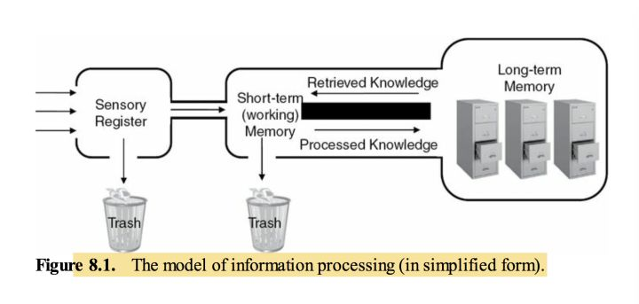

**图片来自《Vygosky for Educators》pp109**

***最后一个部分是“习惯化”***

也就是整套的“由知到行”，很多人一次做对了，但是很难说每次都做对。**习惯化是非常重要的，把一次正确的实践变成习惯，把理论内在化，把这个东西变成你身体的一个部分，当你去使用它的时候你甚至可以不用思考。这也是文化社会学家Bourdieu所谓的文化惯习（Habitus）。**

这可能是学习的最高境界。比如说，有些人说英语可能真的不用去想语法，但是我们说英语的时候可能会去思考怎么使用语法。当我们使用多了以后，我们也就不用去思考很多东西，这样的话可能也就达到了一个很高的“知行合一”的境界。

**英语学习的术：**

**学习体系：**

在英语学习的日常实践中，要逐渐形成适合自己的一套学习体系。我觉得要做到四个要点：**生态化，流程化，数据化以及精细化。**

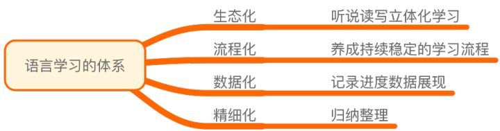

**生态化**：把英语学习当成是一个有机的生态整体，听说读写环环相扣，互相促进，而不是人为拆分，单词不好狂补单词，口语不好只练口语。从一开始就注重全面平衡进展，哪怕进度稍微慢一些。

**流程化**：养成持续稳定的学习流程，避免三天打鱼两天晒网的波动性学习。比如每天2小时英语学习，固定半小时练习听力，半小时背记单词再花1小时学习语法和阅读，周末的时候写一篇作文。这样的常规式稳定流程化学习确保了学习的稳定和积累。

这里介绍一个将时间流程化做到极致的大牛，柳比歇夫。他是哲学家，昆虫学家以及数学家，坚持56年用时间统计法，在80多岁的生涯中完成了70多部学术著作。一生效率之高，跨领域之多让人敬佩。由俄罗斯作家格拉宁所写的柳比歇夫传记《奇特的一生》详细展现了他流程化的时间管理。

虽然我在做自己的时间投资管理的时候，并不知道柳比歇夫。以上是我的时间记录表格，和他的精细化管理本质上相似。

我之前学习语言的时候要求自己每日高效学习4小时，尽量不熬夜，正常作息。

表格非常简单，也是用普通的Excel记录。横轴是时间，以每周为单位。

如：2017.10.23-10.29

周一， 周二， 周三， 周四， 周五， 周六， 周日

纵轴是项目名，因人而异。我会把项目按照优先级以及时间比从上往下排序。

每个项目对应的具体任务会写在当日的框里面，完成标双划线。

如果遇到特殊情况，既定任务在当日无法完成，不会感到懊悔，而是顺延到下一天的任务一起完成。在保持整体进度不受影响下，灵活机动。

这样一个简单的表格让我对语言学习时间的安排有了精细明确的感觉，每周每月以及每年都可以定期复盘回顾，了解情况来进行调整。

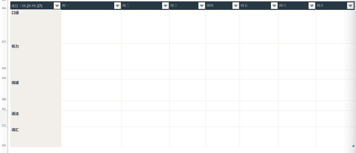

**数据化**：虽然语言能力很难定量化检测，我们还是可以定期记录学习数据，了解自己的进度和效果。这样可以定量地让我们清晰地了解自己目前的进展。比如花了多少时间在各项的时间，单词记录的总数，语法错误的出现率等等。

**精细化**：不断归纳整理，结合Onenote，打造自己的英语学习库，如英语文化背景库，常用口语表达库，写作好词好句库，语法易错点库，英剧美剧库等等。把学过的知识点，看到的好的语言素材，犯过的错误全部精细化整理。

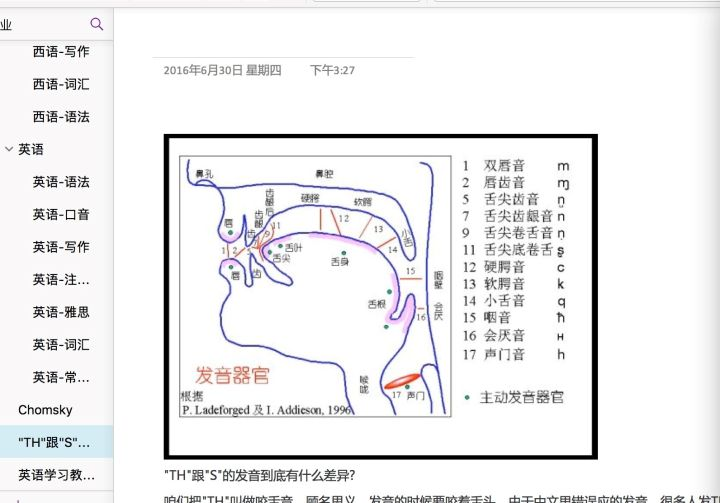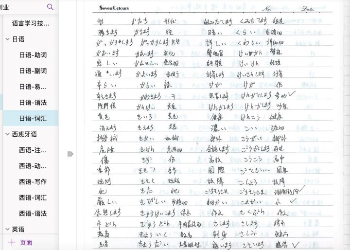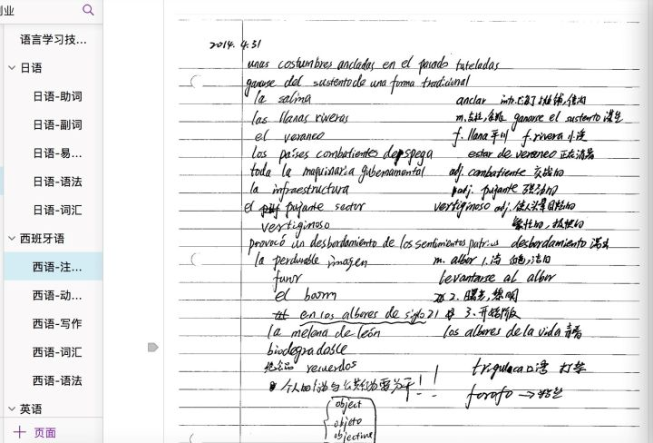

(我的语言学习库)

**学习周期：**

最后来谈谈学习周期以及不同阶段推荐使用的学习材料。

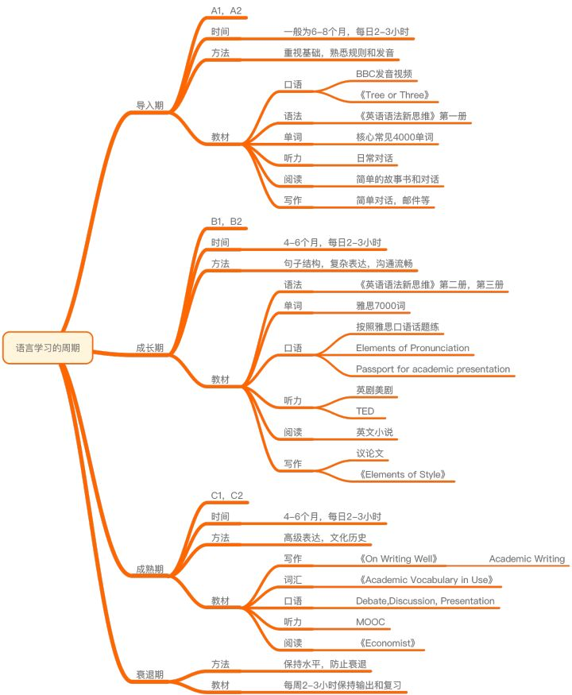

欧洲通用语言框架将语言能力分为6个等级，A1，A2 （初级）；B1，B2（中级），C1，C2 （高级），分别对应不同的语言能力阶段。

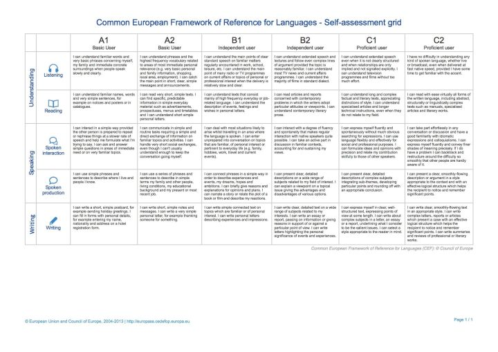

以下是我做的翻译，根据欧洲标准语言框架，语言能力主要展现在理解，口语和写作三个维度。其中理解细分为听力和阅读，口语细分为口语对话和口语表达。

根据我个人的实践以及每个阶段的特性，**我将语言学习看做一个生命周期，每个阶段有着不同的特点（类似下图的产品生命周期），A1，A2为导入期； B1，B2 为成长期，C1，C2为成熟期，而这之后如果语言没有经常使用则会慢慢退化进入衰退期。**

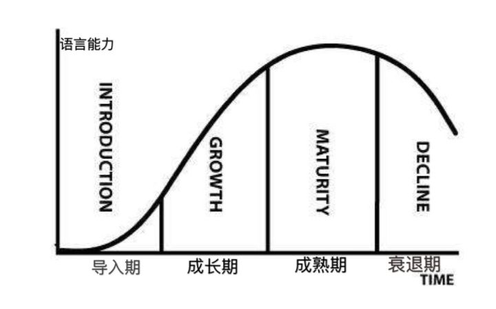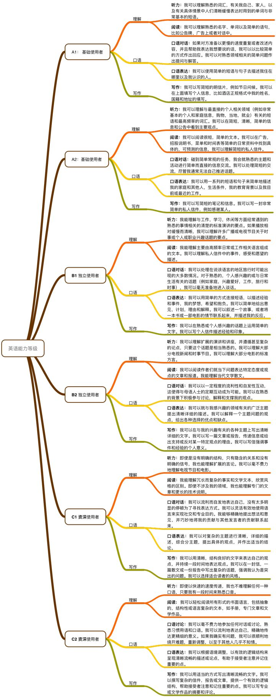

**导入期：**

导入期是语言学习从0到1的阶段，就像盖楼处于打地基的阶段，也是最艰难和关键的的。**这时候你从零基础接触英语，在很长的一段时间内，学习不会有明显的起效，你可能会灰心，会觉得自己并没有天分。**随着慢慢坚持，特别是到了导入期后期，你会感到慢慢对英语有了感觉，进度也逐渐加速。

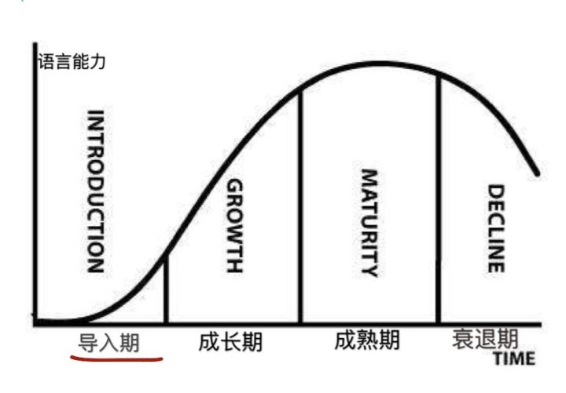

A1，A2 英语基础使用者的特点如下：

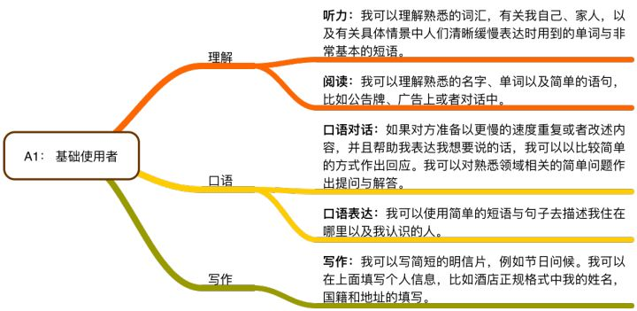

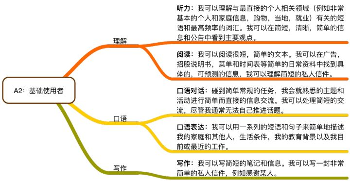

按照每天2-3小时的学习投入，导入期大约为6-8个月。

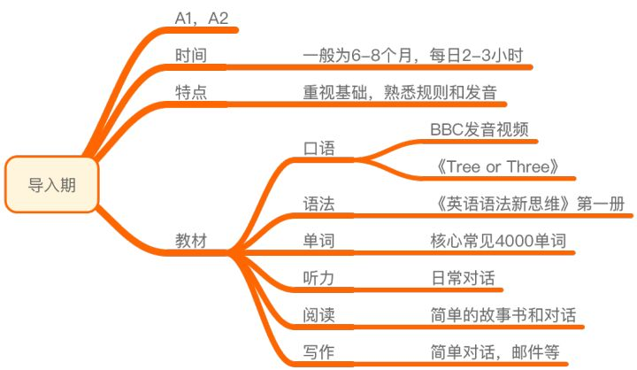

**教材推荐：**

**音标入门：**

**《Tree or Three》：**《剑桥国际英语语音入门(第2版)》讲述了：它与《Ship or
sheep？》为同一系列，是由剑桥大学出版社出版的最为经典的英语语音教材。包含科学，系统的语音练习：逼真的口型图，详细的发音指导，互动的语音、音节、连读、重读与弱读、句子重音、语调、句子节奏等语音练习。最小对立体（minimal pairs）的对比发音训练。特别适合中国学习者比较和纠正容易混淆的发音，在语音对比中更快更好地掌握英语发音的规律。丰富的词汇短语、短句及对话近2000个单词以及相关的短语、短句和真实对话；600余幅插图。

亚马逊链接：[https://www.amazon.cn/%E5%89%91%E6%A1%A5%E5%9B%BD%E9%99%85%E8%8B%B1%E8%AF%AD%E8%AF%AD%E9%9F%B3%E5%85%A5%E9%97%A8-Ann-Baker/dp/B002I7TEPK/ref=sr\_1\_1?ie=UTF8&qid=1510384693&sr=8-1&keywords=Tree+or+three](https://link.zhihu.com/?target=https%253A//www.amazon.cn/%25E5%2589%2591%25E6%25A1%25A5%25E5%259B%25BD%25E9%2599%2585%25E8%258B%25B1%25E8%25AF%25AD%25E8%25AF%25AD%25E9%259F%25B3%25E5%2585%25A5%25E9%2597%25A8-Ann-Baker/dp/B002I7TEPK/ref%253Dsr_1_1%253Fie%253DUTF8%2526qid%253D1510384693%2526sr%253D8-1%2526keywords%253DTree%252Bor%252Bthree)

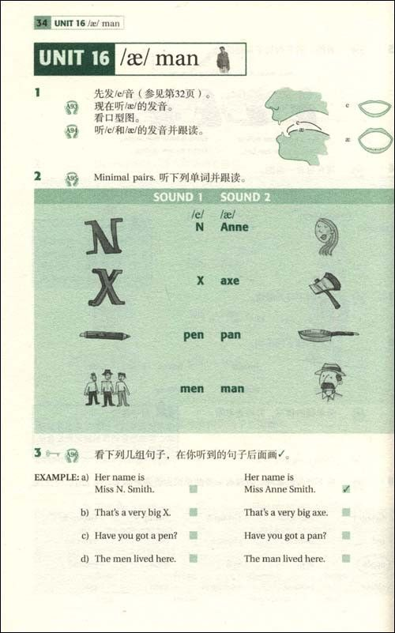

单个音标的发音及口型还可以重点参考：BBC出品的英式发音教程

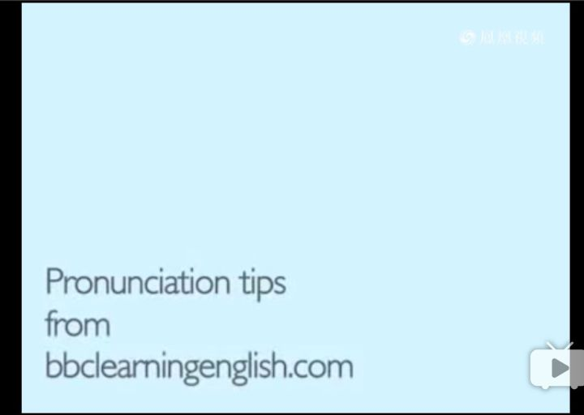

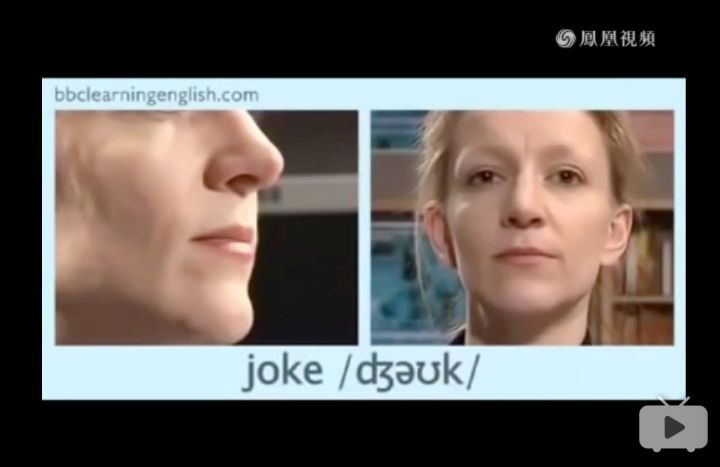

B站视频连接：[http://www.bilibili.com/video/av3102611/](https://link.zhihu.com/?target=http%253A//www.bilibili.com/video/av3102611/)

语法：重点推荐剑桥校友张胜满的《英语语法新思维》初级教程-走近语法

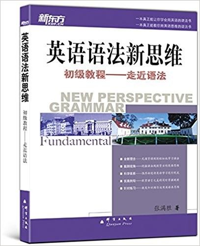

这套书强调英语语法背后是英语的思维。英语学习者应该把语法当作思维规律来理解，而不应该当作规则来死记，把“死规则”转化为“活思维”。也就是我在道中强调的“追求事物的底层逻辑”。在书中，作者从比较中英思维上的差距出发，解释英语语法。比英文原本语法书更适合国人使用。

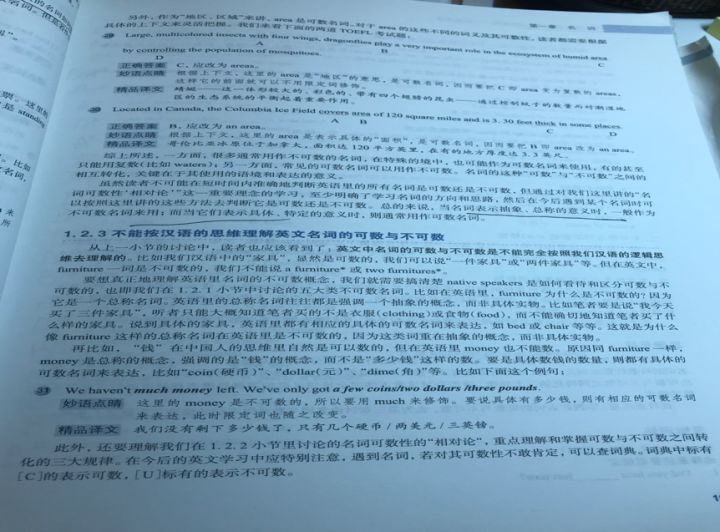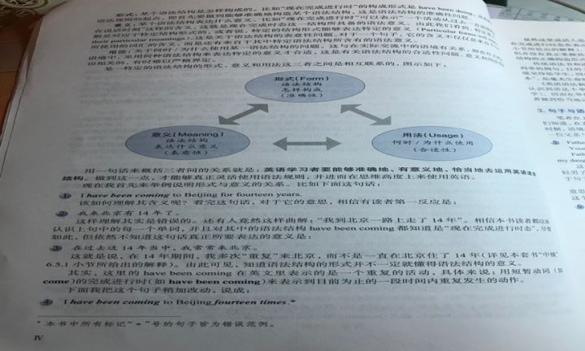

词汇：英语大学四级词汇即可

**成长期：**

**完成导入期后，英语学习进入成长期。在成长期中，我们完成从英语的基础使用者到独立使用者的进阶。投入的时间能明显见到效果。**绝大多数完成高中英语学习的学弟学妹以及大学四级在成长期B1阶段，当然因为国内教学考核体系忽视口语，听说能力可能弱于B1，成长期B2往往是英语国家留学的语言的要求。

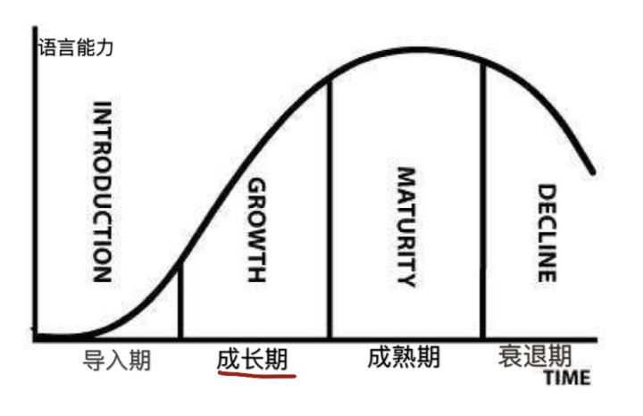

以下是雅思与欧标的通用换算：

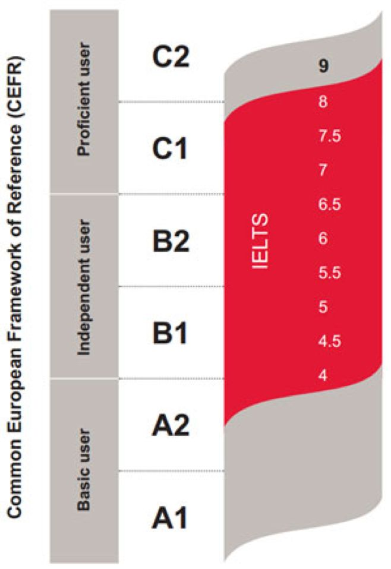

（图片来源[http://IELTS.ORG](https://link.zhihu.com/?target=http%253A//IELTS.ORG)）

B1， B2英语独立使用者的特点，学弟学妹们可以自我对照一下。

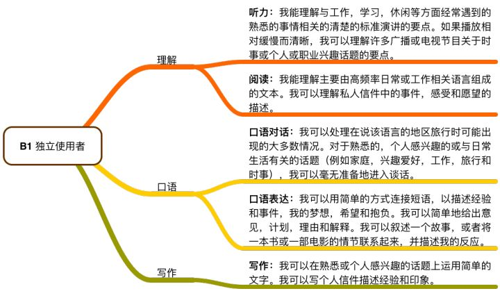

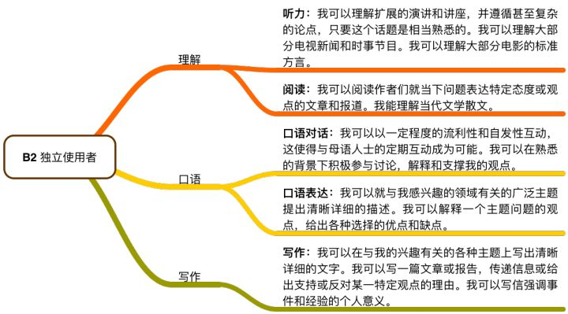

成长期比导入期的时间稍短，按照每日2-3小时投入，大约需要4-6个月。**渡过了导入期苦哈哈的日子，成长期我们可以充分享受到语言学习带来的乐趣。对于非专业性的工作和学习，成长期的英语能力都能够应付。在成长期因为英语基础的提升，学习资源也特别丰富。**

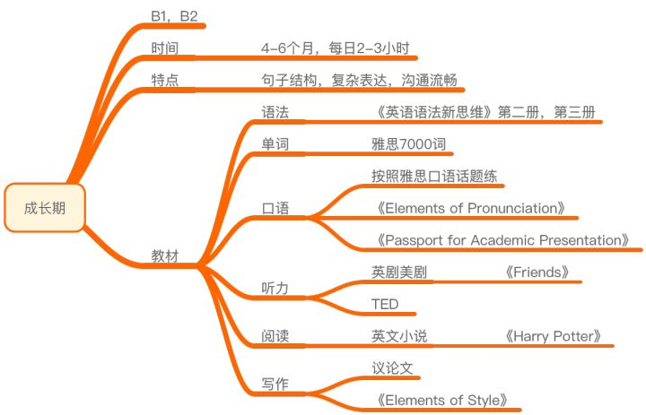

**推荐教材：**

语法：继续《英语语法新思维》系列，完成第二册中级和第三册高级的学习。

单词：在之前4000词的基础上，按照雅思7000核心词学习，这一部分教材市面上也很多。

口语: 口语话题可以直接按照雅思话题来进行练习。在这一阶段，我们可以熟悉练习英语的弱读，连读等表达习惯。

这里首推《Elements of Pronunciation》：

来自剑桥大学语言教学中心（Cambridge Language Centre)的官方推荐，我拜读后对英语发音的理解和掌握有了质的提升。剑桥大学出版社（Cambridge Press）曾出版过一书Elements of
Pronunciation 发音的要素，着重解决 weak form--弱读，cluster--例如辅音音节连续出现在一个单词中，link-up--连读，contraction--缩略， stress time --一句话里面各重点单词所花时间是一样的，这些方面的发音问题。

以下是我从***Elements of Pronunciation***一书中整理出的三个连音规律：

1，连接词末的辅音与后一词词头的元音

例如：read it
变为 rea-dit

put-it-off 变为
pu-ti-toff

2 , 以辅音字母r结尾的单词跟着一个以元音开头的单词时，r的发音往往是保留的

例如： after
all 变为 afte-rall

3 , 连接词末的元音与后一词词头的元音

例如：do it 变为 do-it 其中o-i发/w

You are; I
ought;

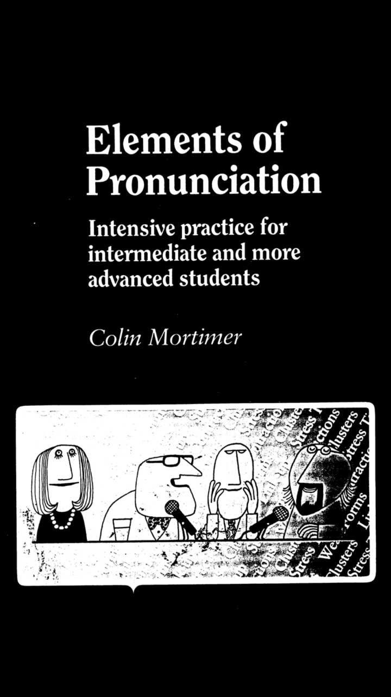

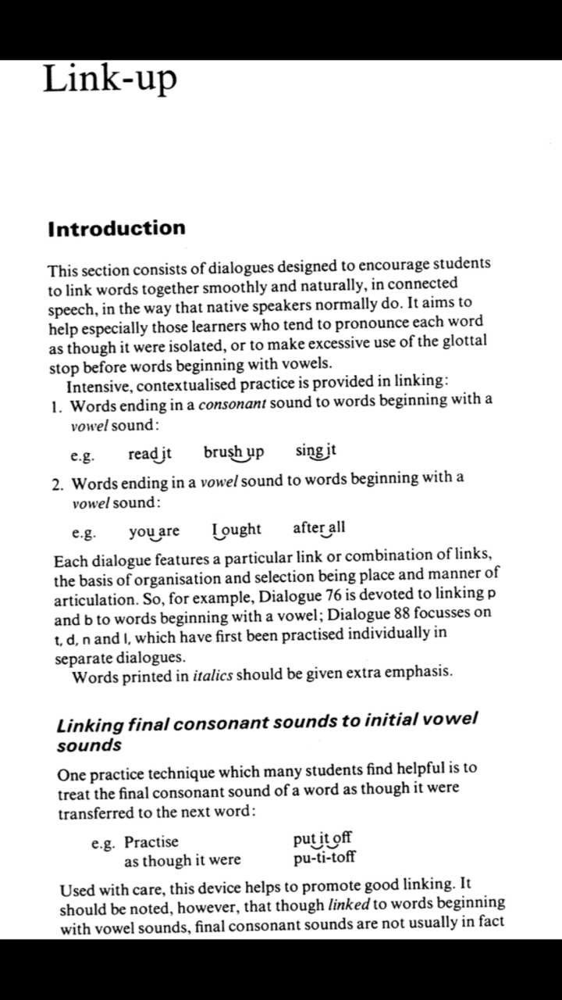

此外，在成长期，你也应该了解如何做专业的演讲（Presentation）。这里首推英语教育学大师Douglas Bell的《Passport for Academic Presentation》。书中介绍了各类常见的演讲表达方式及技巧。

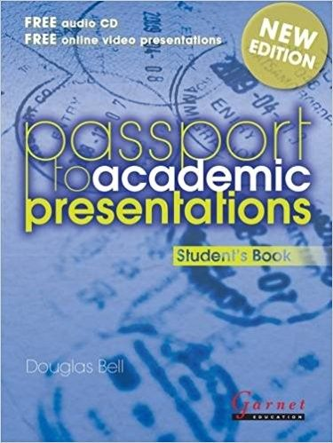

以及 《Talk like Ted》，《像Ted演讲一样说话》

Ted是非常经典的演讲方式，追求以20分钟左右的演讲时间传递一个想法。这本书很好地分析了Ted演讲的一些技巧以及案例，生动形象，结合书中的案例观看，非常易读。

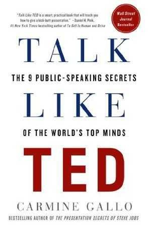

亚马逊链接：

[The 9](https://link.zhihu.com/?target=https%253A//www.amazon.com/Talk-Like-TED-Public-Speaking-Secrets/dp/1250061539/ref%253Dsr_1_1%253Fie%253DUTF8%2526qid%253D1497944860%2526sr%253D8-1%2526keywords%253Dtalk%252Blike%252Bted)
[Public-Speaking Secrets of the World&amp;amp;amp;\#x27;s Top Minds: Carmine](https://link.zhihu.com/?target=https%253A//www.amazon.com/Talk-Like-TED-Public-Speaking-Secrets/dp/1250061539/ref%253Dsr_1_1%253Fie%253DUTF8%2526qid%253D1497944860%2526sr%253D8-1%2526keywords%253Dtalk%252Blike%252Bted)
[Gallo: 9781250061539: Amazon.com: Books](https://link.zhihu.com/?target=https%253A//www.amazon.com/Talk-Like-TED-Public-Speaking-Secrets/dp/1250061539/ref%253Dsr_1_1%253Fie%253DUTF8%2526qid%253D1497944860%2526sr%253D8-1%2526keywords%253Dtalk%252Blike%252Bted)

与大家分享我做的读书脑图,放大可见笔记细节。

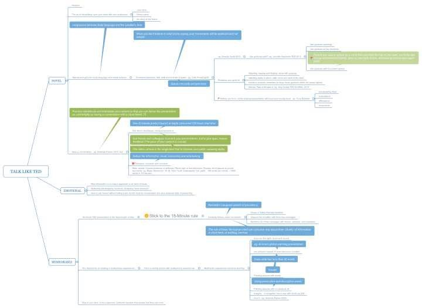

听力的练习可以开始看英剧美剧,TED 以及英文纪录片，特别是BBC出品的系列纪录片。英剧美剧首推《老友记》《Friends》作为入门款。作为经典美剧，《Friends》中的用词都非常接近生活场景，简单易懂，表达灵活，本身内容讲述的是一群大学刚毕业年轻人的生活。可以看无字幕版，反复看，边看边记录好的表达。共有10季，当年我练习西班牙语听力就是从《Friends》的西班牙语版《Amigos》看起的，看了不下五遍

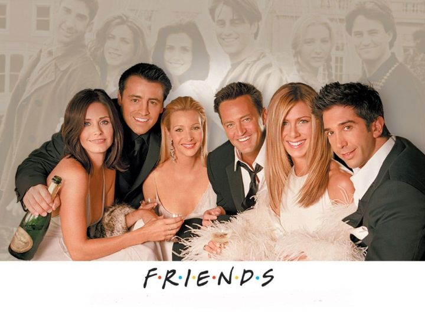

同时你可以开始听一些TED演讲，学习优秀TED主讲人的表达和思想。

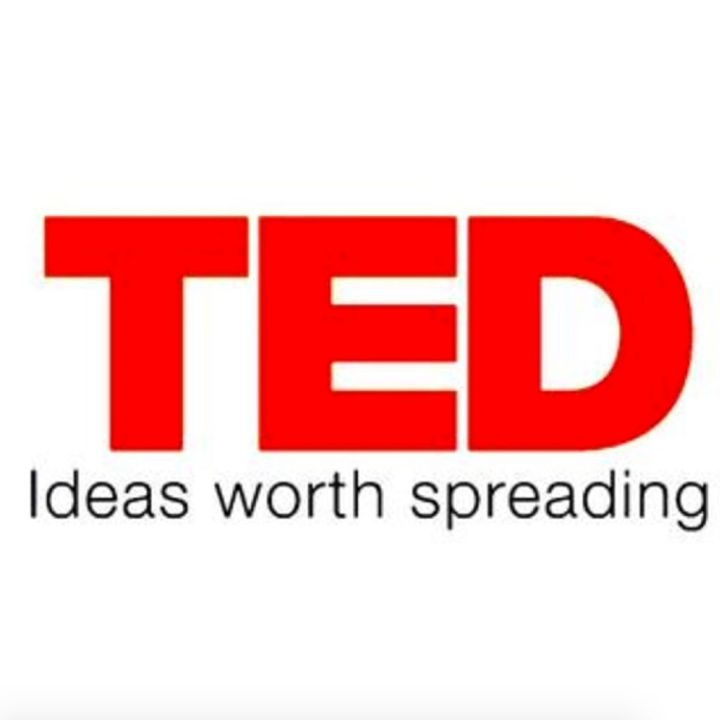

阅读：你可以开始读一些英文小说，这里首推《Harry Potter》《哈利波特》作为入门级阅读，再慢慢进阶到其他难度更大的英文文学。

J·K罗琳编织的魔法世界下年轻的巫师们成长的故事。可是说是十分经典的读物了，有趣又不缺乏思考。虽然系列中有总计7本书，每一本都毫不逊色，情节一环扣一环，在生动展示了魔法世界的神奇和不可思议的同时，向我们呈现了各个角色丰富的内心世界和他们各自的成长。单词量不大，唯有些比较难读的咒语，但是把它们记下来岂不是很酷吗？

同时可以开始阅读新闻报道，比如BBC新闻。

最后谈谈写作，强烈推荐 《Elements of Style》。

《Elements of Style》 by [William Strunk Jr.](https://link.zhihu.com/?target=https%253A//www.amazon.com/William-Strunk-Jr./e/B000AQ6TSQ/ref%253Ddp_byline_cont_book_1)

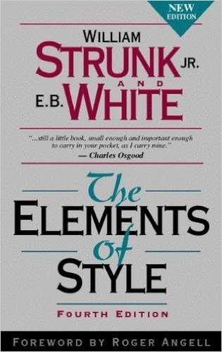

评价:

"Buy it, study it, enjoy it. It's as timeless as a book can
be in our age of volubility."

— *The New York Times*

"No book in shorter space, with fewer words, will help any
writer more than this persistent little volume."

— *The Boston Globe*

"White is one of the best stylists and most lucid minds in
this country. What he says and his way of saying it are equally
rewarding."

— *The Wall Street Journal*

作者介绍：

William Strunk Jr. (1 July 1869 – 26 September 1946), was a
professor of English at Cornell University and author of the The Elements of
Style (1918). After revision and enlargement by his former student E. B. White,
it became a highly influential guide to English usage during the late 20th
century, commonly called Strunk & White.

《格调的元素》

这本书作为这个时代的畅言标志，有永恒价值。 --纽约时代

相比短小精悍、容量巨大的这本书，没有一本书可以通过更少的内容、空间，更多地帮助其他作家。--波士顿

White拥有这个国家最清晰的头脑与最好的写作风格。在此书中，他表述的内容以及他表达的方式都具有很高的价值。 --华尔街

作者简介

William 是康奈尔大学的英文教授，风格元素的作者。这本书经过他原学生White的修改与扩充，成为20世纪末有影响力的英文使用指导。

亚马逊链接：

[The Elements of](https://link.zhihu.com/?target=https%253A//www.amazon.com/Elements-Style-Fourth-William-Strunk/dp/020530902X/ref%253Dsr_1_1%253Fie%253DUTF8%2526qid%253D1496107835%2526sr%253D8-1%2526keywords%253Delements%252Bof%252Bstyle)
[Style, Fourth Edition (9780205309023): William Strunk Jr., E. B. White, Test](https://link.zhihu.com/?target=https%253A//www.amazon.com/Elements-Style-Fourth-William-Strunk/dp/020530902X/ref%253Dsr_1_1%253Fie%253DUTF8%2526qid%253D1496107835%2526sr%253D8-1%2526keywords%253Delements%252Bof%252Bstyle)
[Editor, Roger Angell: Books](https://link.zhihu.com/?target=https%253A//www.amazon.com/Elements-Style-Fourth-William-Strunk/dp/020530902X/ref%253Dsr_1_1%253Fie%253DUTF8%2526qid%253D1496107835%2526sr%253D8-1%2526keywords%253Delements%252Bof%252Bstyle)

**成熟期：**

**大部分人的英语学习都停留在成长期，因为已经够用了。只有不到1%的学习者，凭借着对语言的喜爱，不满于现状，进入成熟期，精进到成熟期，成为资深使用者。在这一阶段，学习的提高效果不再明显，趋于平缓。**

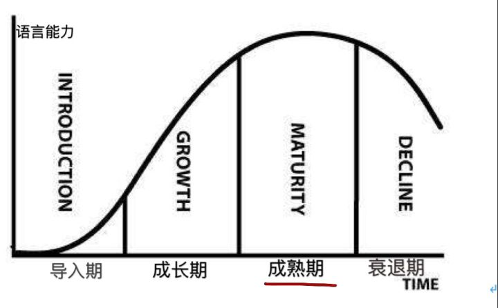

以下是成熟期的语言学习者特点：

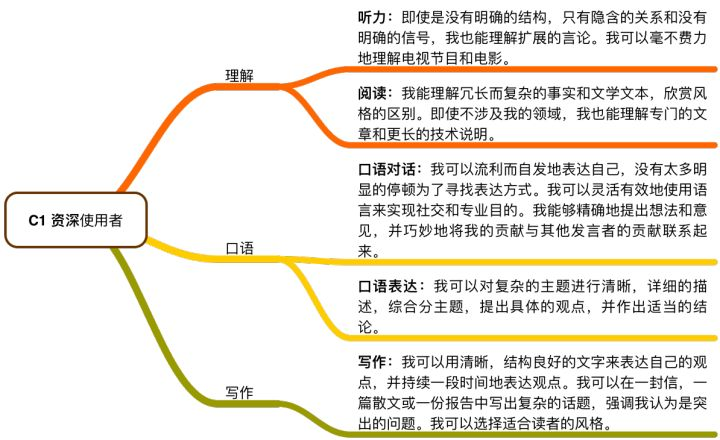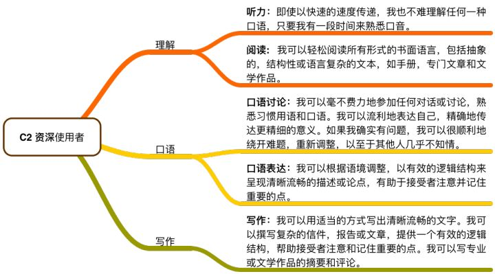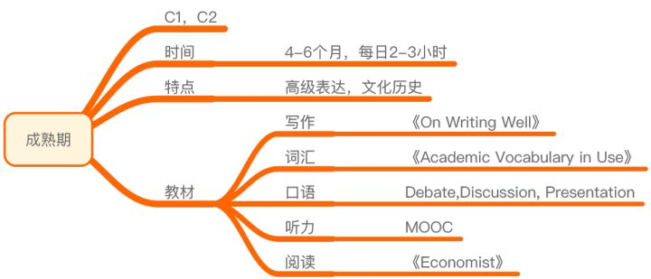

从B2到成熟期，按照每日2-3小时的投入，大约需要4-6个月。

**口语可以关注一些英文的辩论，讨论技巧**。这里首推英国议会辩论。看英国绅士们如何唇枪舌战，就各项政治议题，骂人不带脏字。

**词汇则首推《Academic**
**Vocabulary in Use》，介绍各种词汇在学术场景上的用法。**

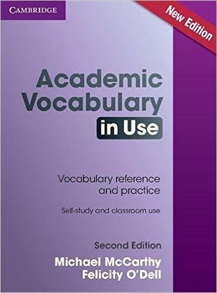

**写作则是《On Writing Well》。**

《On Writing Well》 by [William](https://link.zhihu.com/?target=https%253A//www.amazon.com/William-Zinsser/e/B000AQ1LN4/ref%253Ddp_byline_cont_book_1) [Zinsser](https://link.zhihu.com/?target=https%253A//www.amazon.com/William-Zinsser/e/B000AQ1LN4/ref%253Ddp_byline_cont_book_1) (Author)

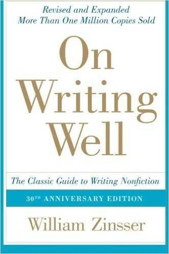

评价：

*On Writing Well* has been
praised for its sound advice, its clarity and the warmth of its style. It is a
book for everybody who wants to learn how to write or who needs to do some
writing to get through the day, as almost everybody does in the age of e-mail
and the Internet. 

Whether you want to write about people or places, science and technology, business, sports, the
arts or about yourself in the increasingly popular memoir genre, *On Writing*
*Well* offers you fundamental priciples as well as the insights of a
distinguished writer and teacher. With more than a million copies sold, this
volume has stood the test of time and remains a valuable resource for writers
and would-be writers.

作者介绍：

William Zinsser
is a writer, editor and teacher. He began his career on the New York *Herald*
*Tribune* and has since written regularly for leading magazines. During the
1970s he was master of Branford College at Yale. His 17 books, ranging from
baseball to music to American travel, include the influential *Writing to*
*Learn* and *Writing About Your Life*. He teaches at the New School in
New York.

历年来，写作之源都因实用的建议、清晰的内容、平易近人的文体而备受赞誉。在这个互联网、电邮成为现实生活重要一部分的时代，每一个期望了解写作之道或打算靠写作谋生的人都能从这本书中获益。

无论你想要描写人物、风景，解释科学、技术原理，展示商务、体育、艺术活动，或是打算写个人的自传、回忆录，写作之源会给你提供基本的写作原则指导，以及作者作为一名出色的笔者对写作自身的观察与思考。截至目前，超过一百万的销量见证了这本书经受时代的考验，依旧对作家以及渴望成为作家的人具有一定的指导作用。

**阅读：**强推《The Economist》《经济学人》。

作为连续五年阅读的铁粉，我来安利一波。

1\. 在公众辩论发出声音，参与讨论的价值观：

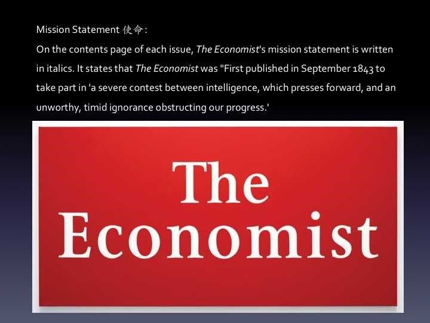

2\. 老少咸宜，千人千面的内容。

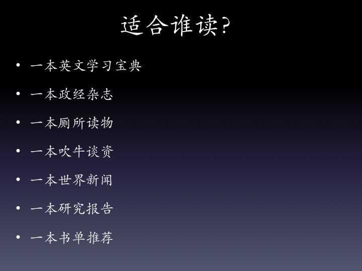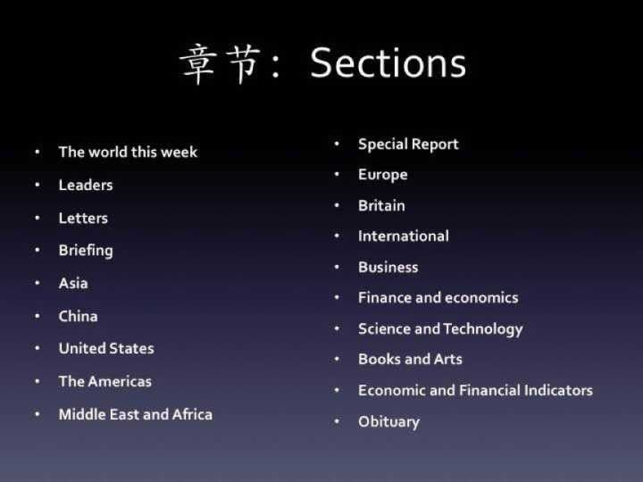

3\. 性感的封面

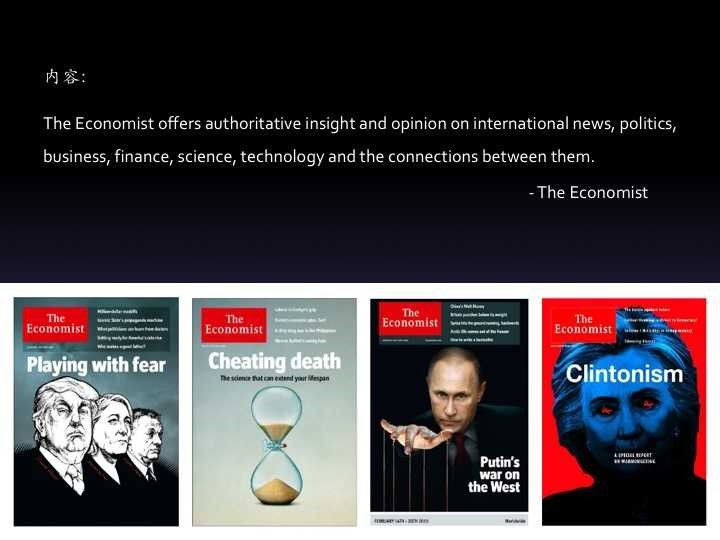

4.有观点，有立场，也有evidence，如图表数据去佐证支持观点。

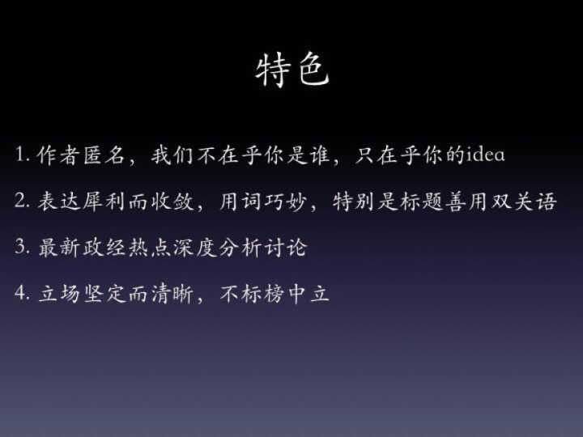

5\. 英语学习宝典，听说读写都有裨益

**最后谈谈听，成熟期的资深使用者，英语能力几乎接近了母语使用者，也就意味着几乎所有英文的教育资源都对你打开了大门**，你可以开始自由地浏览各种世界名校的线上公开课及原版教材，学习自己需要的专业知识。Coursera, Udacity 等平台都有大量资源。

**衰退期：**

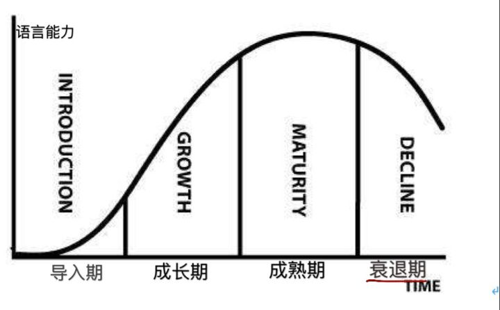

可以说成熟期是英语学习的顶峰。大家都知道，语**言学习如逆水行舟，不用则退。有顶峰，自然也有衰退期**。如果长期不用或者和该语言没有任何接触，语言能力会慢慢退化。

克服衰退期的办法是保持一周2-3小时的接触和复习，使英语能力稳定在成熟期的水平。学习材料与成熟期相同，只不过强度从每天2-3小时减少到一周2-3小时来维持水平。

**最后的寄语：**

语言作为人类特有的能力，其本质是表达，交流，和文化。语言学习重在坚持，也要有科学的愿景，方法论，体系和学习材料。

我不敢说本文推荐的内容都是最科学的，语言学习因人而异，但本文至少是我五年三门语言坚持学习下来的经验总结，推荐的方法和每一份学习材料都有亲身使用。如果对同样是爱好语言学习，但不知从何下手，迷茫甚至灰心的的学弟学妹们有一些小小启发，那也是我花两周写出万字攻略的价值所在。

**学会一门新语言，打开一门新世界。语言学习之路，你不是一个人。**

***如果你对我关于语言学习方面回答感兴趣，欢迎关注：***

[哪些英语单词我们经常用错？](https://www.zhihu.com/question/27036019/answer/245776759)

[每天坚持英语学习为什么还是学不好？](https://www.zhihu.com/question/27702564/answer/124185476)

[为什么很多人学了很多年英语，却不能跟外国人简单交流？](https://www.zhihu.com/question/51921366/answer/166260757)

[哪些英语用法是普通中国学生最生疏的？](https://www.zhihu.com/question/32071242/answer/239999941)

[有哪些出国后才发现的以前对英语的错误理解？](https://www.zhihu.com/question/20597941/answer/244006203)

[《经济学人》杂志好在哪？](https://www.zhihu.com/question/20116977/answer/200929636)

**方法论：**

[学西班牙语的人，你们是怎么走过来的？](https://www.zhihu.com/question/19679453/answer/167228839)

[英语连读有哪些规则跟变音技巧呢？](https://www.zhihu.com/question/20846216/answer/179792439)

[练习英语口语的方法？](https://www.zhihu.com/question/26679393/answer/182850273)

**学术英语：**

[如何提高学术方面的英语水平，尤其是论文写作？](https://www.zhihu.com/question/29519513/answer/177325572)

[在英语学习过程中，有哪些书籍让你醍醐灌顶？](https://www.zhihu.com/question/26483956/answer/234267880)

[英语原版语法书，有哪些推荐的？](https://www.zhihu.com/question/23809624/answer/184168802)

[怎样提高presentation能力？](https://www.zhihu.com/question/33271088/answer/194612021)

[如何提高雅思写作成绩？](https://www.zhihu.com/question/27036019/answer/245776759)

[雅思口语怎么备考？](https://www.zhihu.com/question/35043813/answer/177667010)

更多语言学习笔记见 **微信公众号 潇峰学长，ID：xuxiaofeng600**。

**PS：很多学弟学妹私信我问题，特地建了一个英语学习交流群，群内每天有单词简报和阅读简报，每周日有学长精心整理的干货，定期组织交流和答疑。需要的小伙伴请在我的微信公号 回复“入群”。**

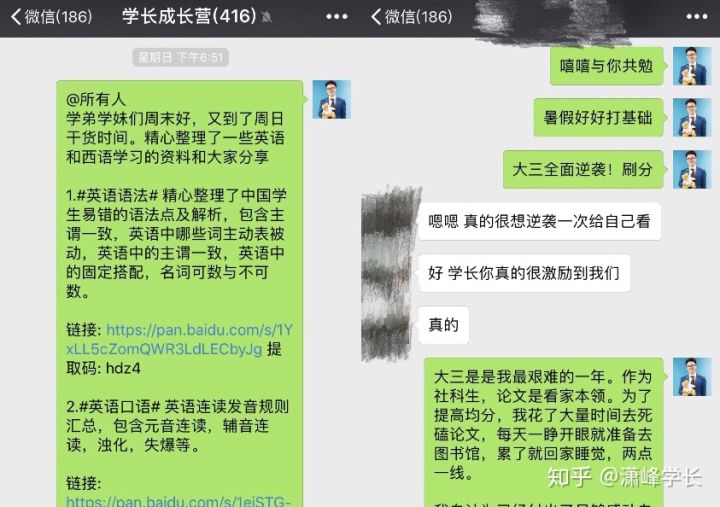

 专注语言学习和青年成长，追求真知，让每一篇掷地有声。

**良心码字，如果你觉得本文有帮助，就点赞分享给更多爱好语言的小伙伴哈~谢谢！**

[编辑于 2019-05-16](https://www.zhihu.com/question/22808635/answer/258783880)