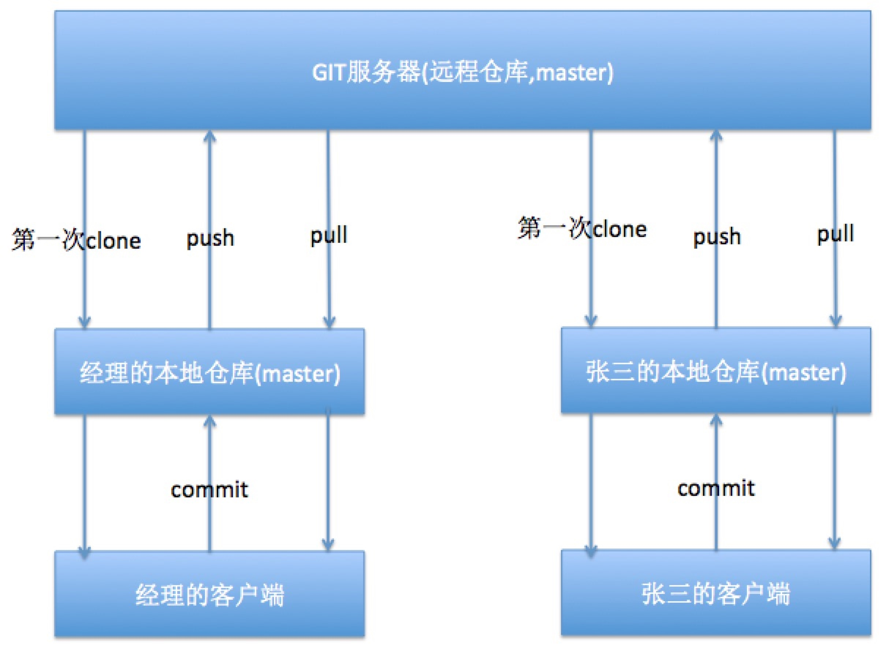
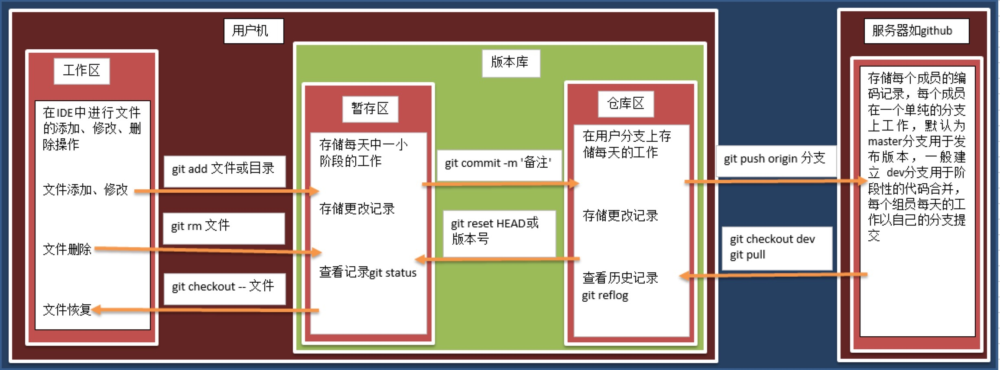

Git操作流程:
--------

clone:获取远程仓库的所有代码

pull:获取远程仓库的部分更新代码

commit:从本地提交到本地仓库

push:从本地仓库提交到远程仓库



工作区暂存区和仓库区
----------

* 工作区
  * 对于`添加`、`修改`、`删除`文件的操作，都发生在工作区中
* 暂存区
  * 暂存区指将工作区中的操作完成小阶段的存储，是版本库的一部分
* 仓库区
  * 仓库区表示个人开发的一个小阶段的完成仓库区中记录的各版本是可以查看并回退的
  * 但是在暂存区的版本一旦提交就再也没有了



单人本地仓库操作
========

提交操作:
-----

安装git:

```sh
sudo install git
```

初始化当前目录:

```sh
git init
```

查看当前目录状态:

```sh
git status
```

提交代码到暂存区:

```sh
git add 文件/目录 
```

提交代码到本地仓库

```sh
git commit -m '备注'
```

添加用户:

```sh
git user.name 'username'
git user.email 'useremail'
```

将工作去目录提交到暂存区:

```sh
git add .
```

查看日志:

```sh
git log(现有版本的修改记录)
```

```sh
git reflog(现有版本+回撤记录)
```

回退&撤销修改
-------

回退上一个版本

```sh
git reset --hard HEAD^
```

回退特定版本:

```sh
git reset --hard 5f7f673(版本号前7位)
```

撤销修改:

撤销工作区代码:

```sh
git checkout 文件名
```

撤销暂存区代码:

```sh
git reset HEAD
git checkout 文件名
```

对比/删除版本
-------

工作区与本地版本对比:

```sh
git diff  HEAD -- 文件名
# ---表示版本库
# +++表示工作区
```


当前版本与前一版本对比:

```sh
git diff HEAD HEAD^ -- 文件名
# ---表示当前版本库
# +++表示上一版本库
```

删除文件:

```sh
git rm 文件名

# 删除后要添加删除版本
git commit -m '删除描述'
```

撤销删除:

```sh
git checkout 文件名
```

推送/下载最新版本:
----------

推送到远程服务器:

```sh
git push 文件名
```

从远程服务器下载最新版本:

```sh
git pull 文件名
```

分支
==

本地查看当前分支:

```sh
git branch
```

本地创建分支:

```sh
git checkout -b 分支名
git checkout -b dev
```

本地分支推送远程服务器:

```sh
git push -u origin 分支名
git push -u origin dev
```

选择分支:

```sh
git checkout 分支名
git checkout master
```

合并分支(当前属于master分支,其他分支向master合并):

```sh
git merge 分支名
git merge dev
```


