HTML
====

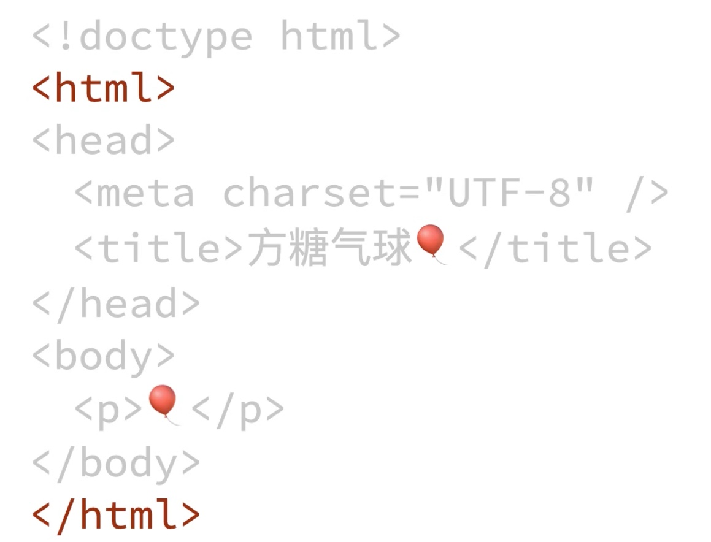

优化SEO:关键词

viewport:设备自适应

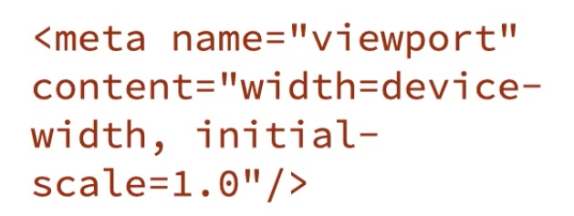

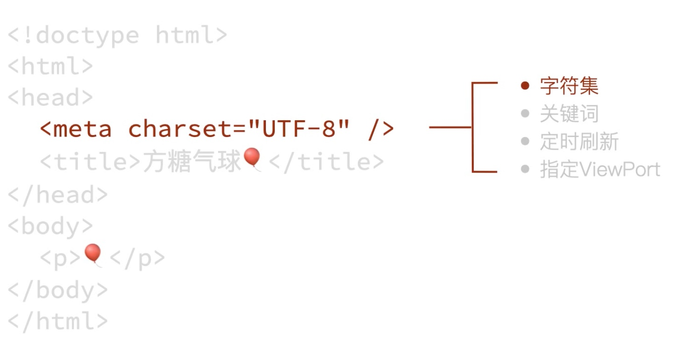

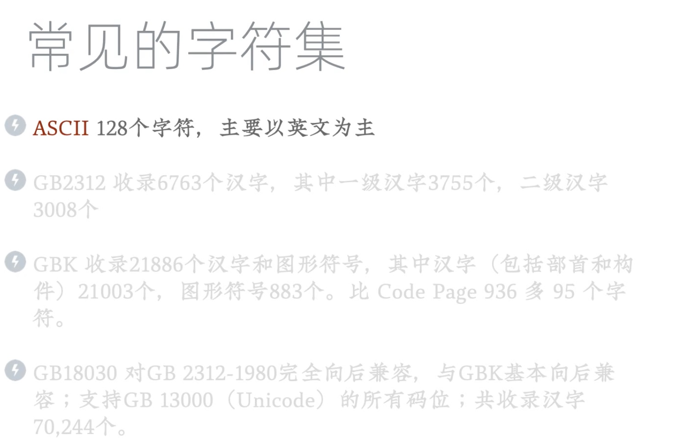

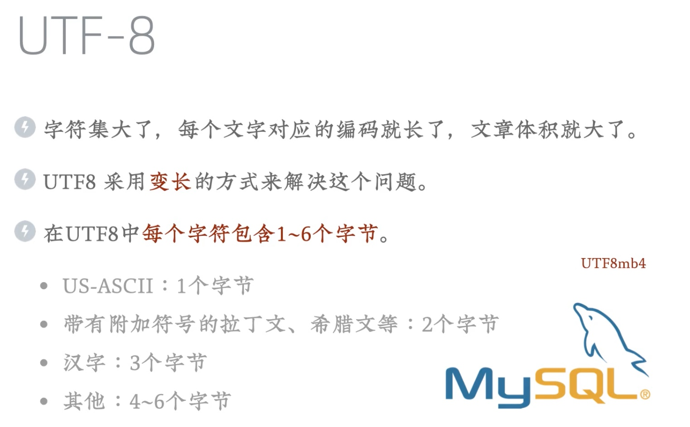

CSS
===

载入css
-----

* 内联样式inline
* style标签
* 独立文件

```html
<!--独立文件-->
<head>
  <link hfref="url.css">
</head>
```

选择器
---

标签选择器

```css
img{height:200px}
```

类选择

```css
img.类名{
  height:200px;
}
img.#id名{
  height:200px;
}

```

属性选择器

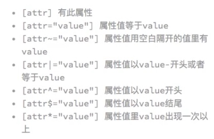

```css

```

伪类选择器

```css

```

常用样式
----

### 内容

```css
/*文字颜色*/
color:#000000;
/*文字对齐*/
text-align:center;
/*文字装饰:下划线*/
text-decoration:underline;
/*首行缩进*/
text-indent:20px;
/*行间距*/
line-height:1.8;
/*字间距*/
letter-spacing:5px;
/*换行*/
word-wrap:break-word;
```

### 元素

```css
/*外边距*/
margin:20px;
/*边框线*/
border:5px solid red;
/*内边距*/
padding:20px

/*溢出*/
/*隐藏溢出*/
overflow:hidden;
/*滚动条*/
overflow:auto;
/*一直显示滚动条*/
overflow:scroll;
/*数轴隐藏溢出,且隐藏滚动条*/
overflow-y:hidden;
/*横轴隐藏溢出,且隐藏滚动条*/
overflow-x:hidden;


```

### 元素定位

```css
/*默认位置*/
/*默认值。没有定位，元素出现在正常的流中（忽略 top, bottom, left, right 或者 z-index 声明）*/
position:static;
top:20px; bottom:10px; left:5px; right:15px;
/*生成相对定位的元素，相对于其正常位置进行定位。*/
/*因此，"left:20" 会向元素的 LEFT 位置添加 20 像素。*/
/*原先的位置不变,其他元素不会占有原有位置*/
position:relative;

/*生成绝对定位的元素，相对于 static 定位以外的第一个父元素进行定位。*/
/*元素的位置通过 "left", "top", "right" 以及 "bottom" 属性进行规定。*/
/*根据父元素计算位置,其他元素会占有原有的位置*/
position:absolute;

/*粘性定位，该定位基于用户滚动的位置。*/
position:sticky;

/*生成固定定位的元素，相对于浏览器窗口进行定位。*/
position:fixed;
```

### 居中/浮动

```css
/*文字居中*/
text-align:center;
/*div水平居中*/
margin-left:auto;
margin-right:auto;
/*div垂直居中(不建议)*/
line-height:页面高度;

/*浮动*/
float:right;
/*按行清理浮动*/
clear:both;

/*显示方式*/
/*内联*/
display:inline:
/*块级元素*/
display:table:
/*隐藏元素*/
display:none:
```

JavaScript
==========

数据类型
----

数值:整形,字符型

字符串:双引号.单引号

数组:[var1,var2]

对象:json{key:"value”}

弱类型:typeof/parseInt/parseFloat

### 类型转换

```js
// 数值转字符串
var str = 123 + ''
// 字符串转数值
var num = parseInt("123")
```

### 数组

```js
push() // 数组最后追加
pop() // 最后弹出删除
unshift() // 数组开头追加
shift() // 数组开头删除
```

### 对象

```js
var city_salary = new Object()
city_salary.city = 'beijing';
city_salary.position = 'fe'
city_salary.salary_min = 10000;
city_salary.salary_max = 30000;

// or

var city_salary = {
city : 'beijing';
position : 'fe'
salary_min : 10000;
salary_max : 30000;
};
```

变量
--

```js
// 全局变量
var num = 123
delete num;

// 局部变量
// delete 无法删除let变量
let num = 123

// 常量
const num = 123
// 常量的值不可改变,但常量的指向的值可以改变
let num = [1,2,3]
const list = num
num.push(4)
// 此时常量list的值是[1,2,3,4]

// 结构赋值(ES6)
// 可以创建和属性同名的变量,然后将对象的属性值赋给创建的同名变量
var city_salary = new Object()
city_salary.city = 'beijing';
city_salary.position = 'fe'
city_salary.salary_min = 10000;
city_salary.salary_max = 30000;

let {city, position} = city_salary;
// 此时let创建的city值是'北京',position值是'fe'
```

操作符
---

算数运算:加减乘除,++/—,+=,%

比较运算符:\>,\<,!=,==,!==,===,?

逻辑运算符:&&,||,!

位运算符:&,|,\>\>,\<\<

字符串运算:+

```js
// == 和 === 
// == 可以进行类型转换后 比较
// === 先判定类型是否相同

// ? 条件运算符
var feel_good = true
price feel_good ? 200:300
语法:(判断式) ? true:false

// 逻辑与 &&

// 逻辑或 ||
// 逻辑或特殊写法
如果title为真则赋值,为假则将右边字符串赋值
var defalult_title = title || 'i am default_title';

// 非 !
// 逻辑非 特殊写法
var weather = ''
!!weather // 强制布尔值转换

// 引入模板 ``
```

流程控制
----

if else 条件执行

switch case default更为复杂的条件执行

for in 循环

while 循环的变体

do while 先执行一遍后再判断

break 终止

函数
--

```js
// 定义
function get_city_salary_info( theone ){
...  
}
```

面向对象
----

```js
class salaryData{
  constructor(city, position, salary_max, salary_min){
    this.city = city;
    this.position = position;
    this.salary_max = salary_max;
    this.salary_min = salary_min;
  }
  
  avg_salary(){
    return(this.salary_min + this.salary_max) / 2;
  }
  
  pure_income(){
    return this.avg_salary() * 0.6;
  }
}

  var sh_fe = new salaryData('shanghai', 'fe',30000,10000)
```

### 继承

```js
class capitalsalaryData extends salaryData{
  constructor(city, position, salary_max, salary_min){
    super(city, position, salary_max, salary_min);
  }
  pure_income(){
    return this.avg_salary() * 0.55;
  }
}

  var sh_fe = new salaryData('shanghai', 'fe',30000,10000)
```

### 构造函数

```js
// get 将类函数定义成属性,直接直接调用该方法
// setter 可以将方法的参数直接指向,不需要()传参
class salaryData{
  constructor(city, position, salary_max, salary_min){
    this.city = city;
    this.position = position;
    this.salary_max = salary_max;
    this.salary_min = salary_min;
  }
  
  get avg_salary(){
    return(this.salary_min + this.salary_max) / 2;
  }
  
  get pure_income(){
    return this.avg_salary() * 0.6;
  }
}

  var sh_fe = new salaryData('shanghai', 'fe',30000,10000)
```

this
----

```js
// 在全局上下文中,this指的是window
// 默认调用,使用全局上下文

// 使用call 或者apple,强制this使用函数上下文,这时 this === o
function showtitle(o){
  console.log(this.tile);
}
showtitle.call({title:"123"})
showtitle.apply({title:"123"})

// bind方法,动态的从一个旧函数创建一个新函数,并把这个新函数的this,绑定到bingd的第一个参数上
var showweibotitle = showtitle.bind({title:'1234'})
showweibotitle(); // 此时函数的this 是 1234

// 在箭头函数中,this保留外部上下文的值
var showtitle2 = () => {console.log(this.title)}
```

模块和包
----

```js
export xxx import xxx
// nomjs.com 包管理系统
// package.json 描述包名
// npm install 将包下载到本地目录
```

DOM
---

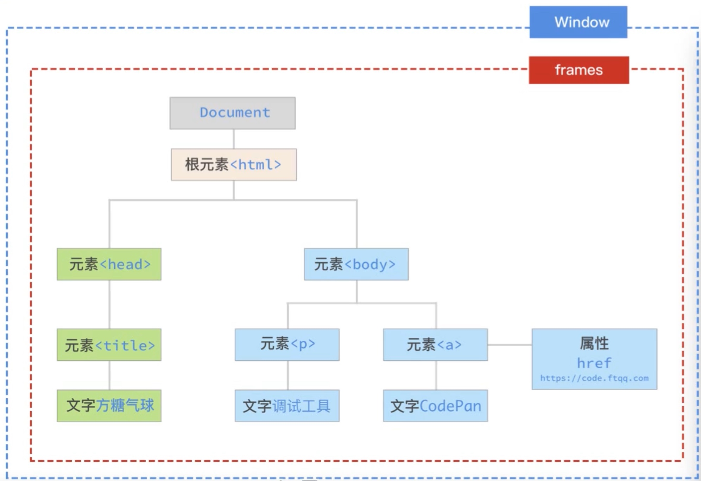

### Window

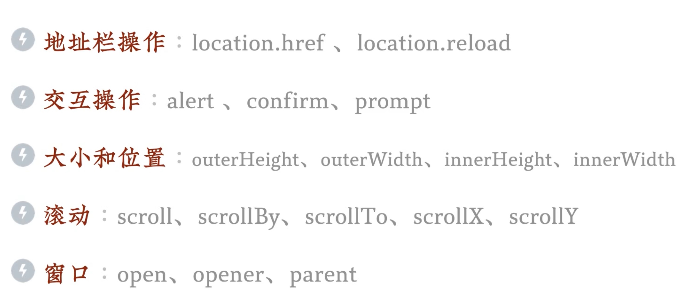

### Document

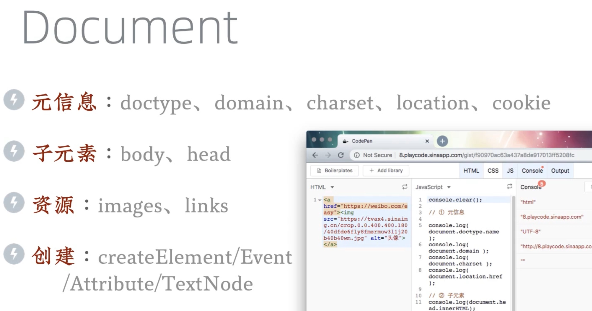

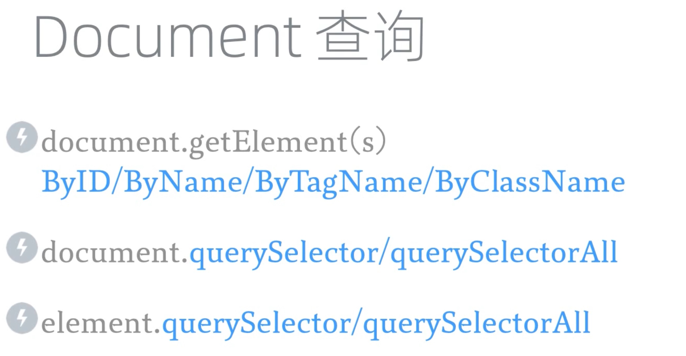

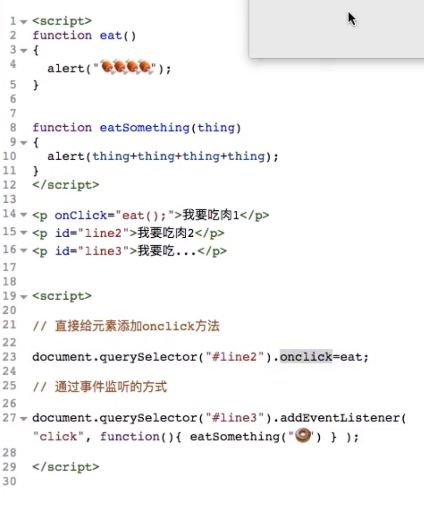

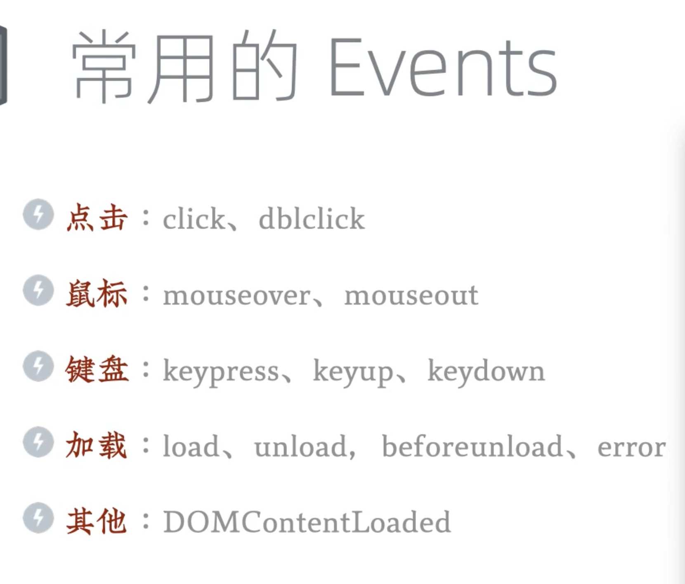

Jquery
------

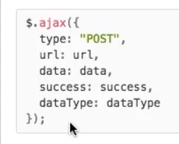

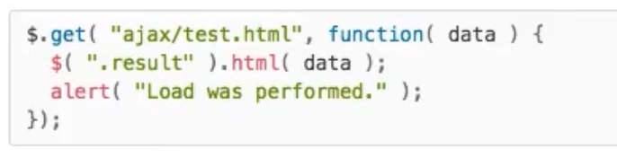

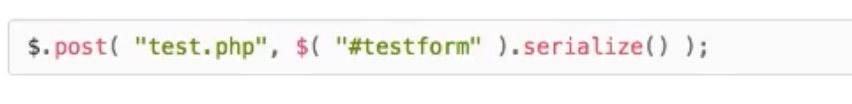

### 代理事件

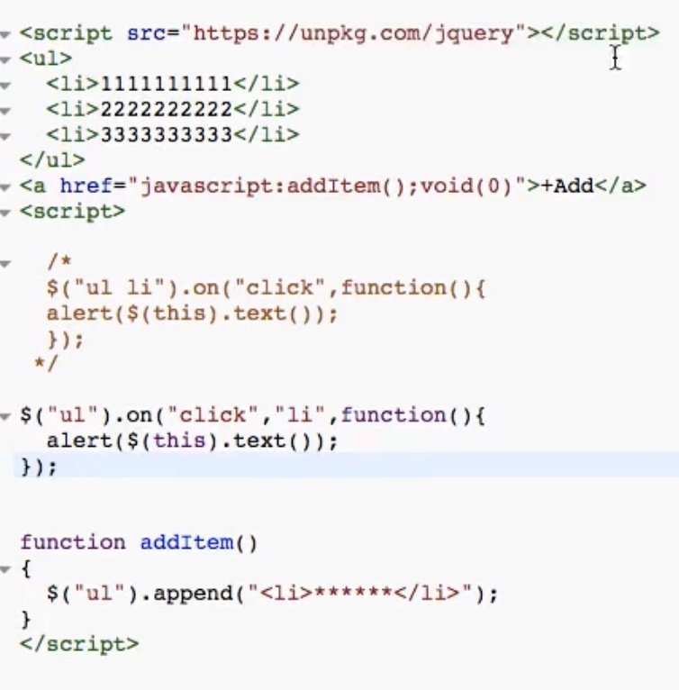


