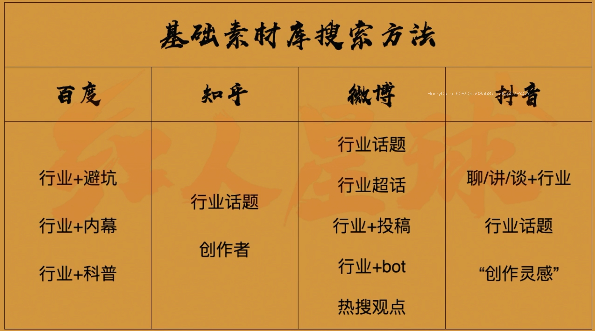

GMV销售额

流量

转化率:客服/售后

客单价:产品

流量
--

传统广告:触达率高,关注有用信息

短视频:看完-影响心情-有兴趣

* **获得特定人群的主动关注**
* **从你找消费者变成消费者找你**
* **从曝光上省大钱,从内容质量花大力**

### 短视频运营:先交朋友后赚钱

* 用满足他人的手段
* 实现自己的目的
* 差异化

* 有用/有趣/有共情
* 商业定位
* 真人/呈现形式

### 数量+质量

建好素材库

* 两台手机
* 一台电脑
* 一记事本

一台手机:只刷一类的视频(了解行业)

一台手机:刷自己感兴趣的(改一改,看看寻求思路)

一台电脑:思维导图/电影/弹幕/评论区/网站查资料

记事本:记录思路/记录听到的文案等等

素材库:

* 选题素材库
  * 基础素材库:抖音/小红书/淘宝/百度/知乎/youtube/ins
  * 行业素材库:论坛/同行群/行业网站
    * 抖音:
      * 聊/讲/谈+行业(聊保险)
      * 行业话题
      * 创作灵感
    * 百度/知乎:
      * 行业+避险/内幕/科普(保险内幕/保险避坑)
      * 行业话题
    * 微博:
      * 行业+投稿/bot(职场投稿)
      * 付费内容(樊登读书/知识星球/微博知乎付费问答/得到app(极客时间))
      * 行业话题
* 内容素材库
* 工具素材库

